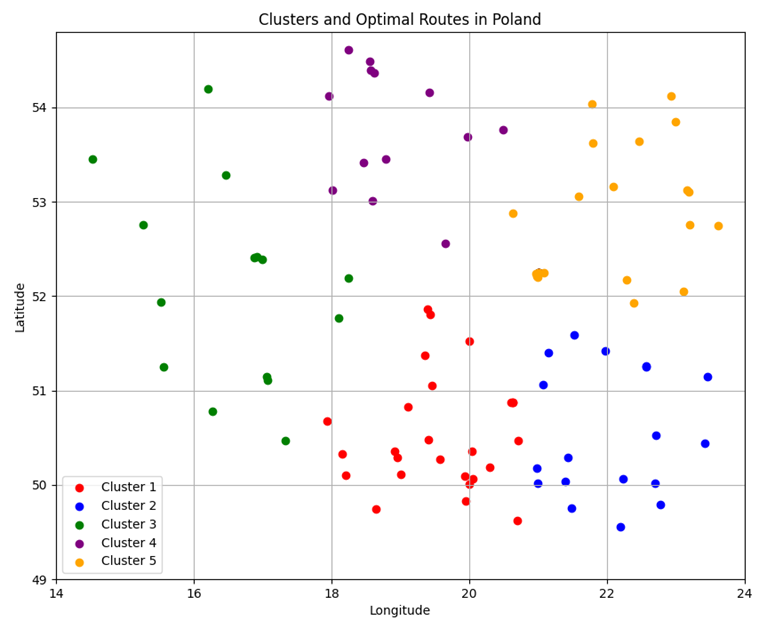
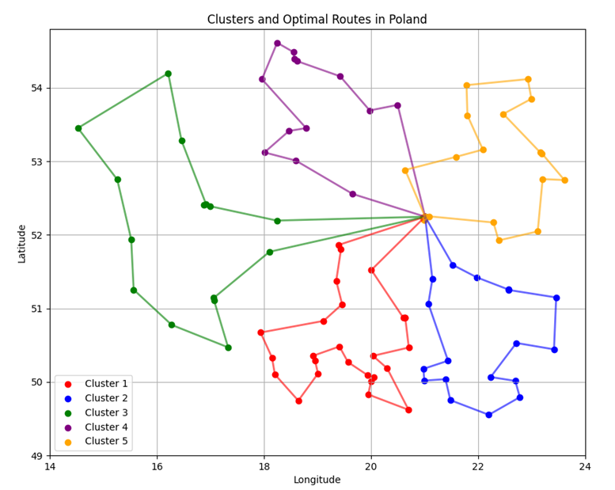
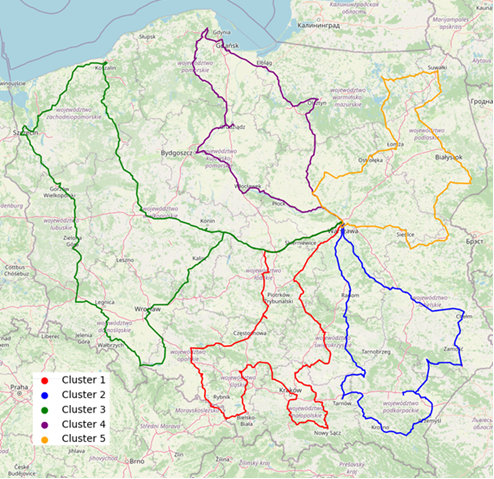

# Cluster Route Planner

## Overview
This project optimizes routes for visiting infectious disease hospitals in Poland. It divides hospitals into 5 clusters and finds optimal routes for each cluster, minimizing the total travel distance for inspections. The optimization is based on minimizing the total length of the travel routes. All routes start and end at the Ministry of Health in Warsaw.

## Features
- Translating hospital addresses to coordinates
- Calculating road distances between locations using OSRM API
- Dividing hospitals into clusters using K-means algorithm
- Solving the Traveling Salesman Problem for each cluster
- Visualizing clusters and optimal routes on maps

## Project Structure
- `get_cords.py` - Geocodes addresses and calculates distances between hospitals
- `main.py` - Implements clustering and route optimization
- `utils.py` - Contains shared utility functions

## Data Preparation
The program geocodes hospital addresses from Excel to obtain coordinates:

## Distance Calculation
Road distances are calculated using the OSRM API to ensure realistic travel estimates:

## Clustering
Hospitals are divided into 5 clusters (one for each vice-minister) using K-means algorithm:

<!-- Insert clusters visualization here -->

## Route Optimization
For each cluster, a near-optimal route is calculated using simulated annealing to solve the TSP. Simulated annealing is a probabilistic technique that provides good approximate solutions to the traveling salesman problem:

<!-- Insert optimal routes visualization here -->

## Results
The program outputs:
- Total distance for each route
- Total combined distance for all routes
- Visualization of optimized clusters and routes

<!-- Insert final solution visualization here -->

## Requirements
- Python 3.7+
- pandas, matplotlib, numpy, sklearn, geopy, requests, python_tsp, folium

## Usage
1. Run `get_cords.py` first to generate coordinate and distance data
2. Run `main.py` to perform clustering and route optimization
3. View generated visualizations and distance calculations
